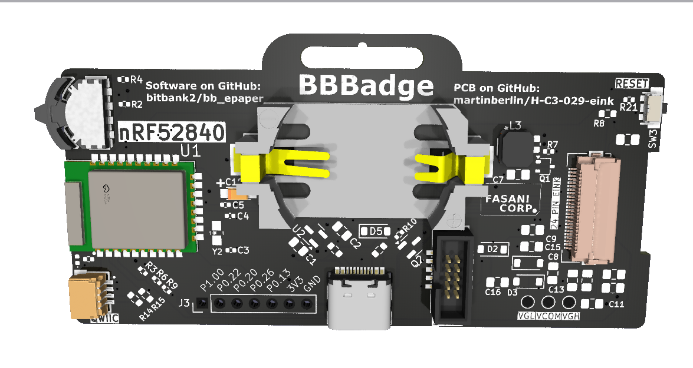

### nRF52840 mini Badger PCB

This PCB design is based on [this nRF52 module datasheet](https://jlcpcb.com/api/file/downloadByFileSystemAccessId/8612736116701077504)

> E73 - 2 G4 M0 8 S1C are wireless Bluetooth modules designed by
Chengdu Ebyte which feature small size, low power consumption. It
adopt the originally imported RFIC nRF52840 of NORDIC, supporting BLE 4. 2 and BLE 5. 0 . The chip has high- performance ARM CORTEX- M4 F kernel and other peripheral resources, such as
UART, I2C, SPI, ADC, DMA, PWM etc.

The most important goals that this PCB achieves:

 - Very low power consumption. In factors of 2 digits micro-amperes (uA) per minute
 - Simple user interface with a multi-directional switch (up, down, select)
 - All open source, including the BLE sending program (MacOS /iOS)
 - Very simple design and schematics
 - QWIIC connector so can support external I2C sensors (Consumption limit: 200mA, limited by LDO MCP1700-330) 

 
### PCB 3D Render

### Related repositories

[MFR Badge](https://github.com/bitbank2/MFRBadge) MacOS/iOS app to program the Maker Faire Rome badges

[bb_epaper](https://github.com/bitbank2/bb_epaper) Larry Bank library for SPI epaper displays 
